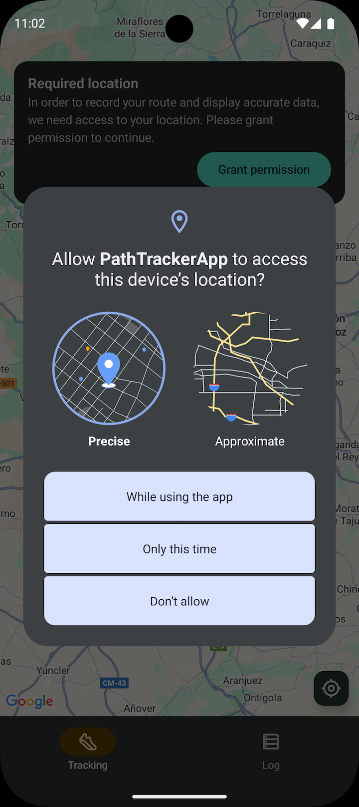
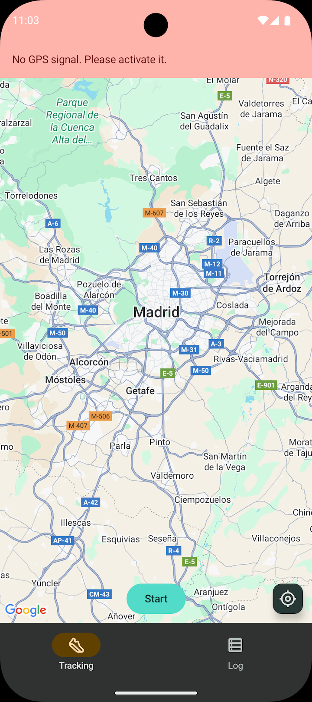
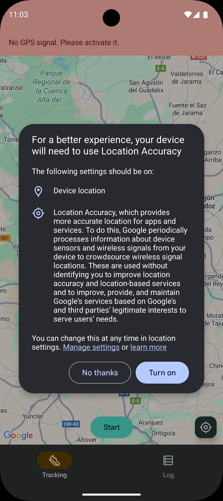

## 🏃‍♂️ Tracking GPS App

Android application to track the user's location in real time developed in **Kotlin** with **Jetpack Compose**, following the MVVM architecture.

The app uses a **Foreground Service** to ensure continuous collection of location data, even when the app is in the background. It records metrics such as start date, duration, average speed, distance, steps, and distance traveled, storing each session locally in **Room**. **Google Maps** is used to display the route in real time.

<p>
<a href="README_ES.md">Leer en Español</a>
</p>

## 📱 Features

* **Activity Log**: Start and stop tracking sessions with a single tap.
* **Real-Time Metrics**: View duration, speed, distance traveled, and steps as you move (step tracking does not work in the emulator).
* **Map View**: Follow your current route on an integrated Google Maps map.
* **Background Tracking**: Using a `Foreground Service`, the app continues recording your activity without having the app in the foreground.
* **Notification Control**: Stop tracking directly from the foreground service notification, without having to open the app.
* **GPS Check**: Detects if the device's location is enabled at all times using a `Broadcast Receiver`.
* **Session History**: Access a complete list of all your sessions saved in the local database.

## 📚 Table of Contents

- [Tech Stack & Architecture](#-tech-stack--architecture)
- [Screenshots](#-screenshots)
- [Installation and Run](#-installation-and-run)
- [Contact](#-contact)

## 🛠️ Tech Stack & Architecture

The project follows an **MVVM (Model - View - ViewModel)** architecture, separating responsibilities into different layers to improve code scalability, testability, and maintainability.


| Component                 | Technology                            |
|:--------------------------| :------------------------------------- |
| **UI**                    | Jetpack Compose                        |
| **Architecture**          | MVVM & Clean Architecture              |
| **Dependency Injections** | Hilt                                   |
| **Service & Receiver**    | Foreground Service & BroadcastReceiver |
| **Local Storage**         | Room                                   |
| **Maps**                  | Google Maps SDK for Android            |
| **Image Loading**         | Coil                                   |
| **Navigation**            | Compose Navigation                     |

### Architecture Diagram

The app is structured into four main layers: **Data**, **Domain**, **UI** and **Service**.

```
.
├── data
│   ├── local
│   │   ├── dao
│   │   ├── entity
│   │   └── relation
│   ├── permissions
│   └── repository
│
├── domain
│   ├── model
│   ├── permissions
│   └── repository
│
├── ui
│   ├── navigation
│   ├── screens
│   ├── theme
│   └── utils
│
└── service
```

* **Data**: Contains the data access logic.
    * `local`: Room database (`dao`, `entity`, `relation`).
    * `permissions`: Concrete implementation for handling Android permissions (location, notifications).
    * `repository`: Implementation of the repositories that abstract data access.
* **Domain**: Contains the business rules of the application.
    * `model`: Business logic data models.
    * `permissions`: Interfaces and models for permission management.
    * `repository`: Interfaces that define the contracts for the data layer.
* **UI**: Interface with Jetpack Compose.
    * `navigation`: Navigation handling with Compose.
    * `screeens`: Contains each screen with its `ViewModel` and the `BroadcastReceiver` for checking GPS status.
    * `theme`: Definitions of colors, typography, and styles.
    * `utils`: UI Utilities.
* **Service**: Module dedicated to the `Foreground Service` that manages location tracking.
    * Contains the service implementation and its Hilt dependency injection module.

## 📸 Screenshots

|                                      **Notification Permission Dialog**                                      |                                      **Banner No Location Permission**                                      |                                     **Location Permission Dialog**                                     |
|:------------------------------------------------------------------------------------------------------------:|:-----------------------------------------------------------------------------------------------------------:|:------------------------------------------------------------------------------------------------------:|
|       |           |        |
|                                           **GPS Disable Warning**                                            |                                            **Enable GPS Dialog**                                            |                                        **Tracking in Progress**                                        |
|                     |        |                       |
|                                          **Tracking Notification**                                           |                                       **Session Summary (no title)**                                        |                                      **Save Session (no title)**                                       |
|  |          |  |
|                                       **Session Summary (with title)**                                       |                                             **Discard Session**                                             |                                           **Empty History**                                            |
|   |  |                            |
|                                                 **History**                                                  |                                                                                                             |                                                                                                        |
|                             |                                                                                                             |                                                                                                        |

## ⚙️ Installation and Run

1. **Clone this repository.**
2. Open the project in **Android Studio**.
3. Set up your **Google Maps API key**:

* Get an API key from the [Google Cloud Console](https://console.cloud.google.com/google/maps-apis/overview).
* Add it to your `local.properties` file:
  ```properties
  MAPS_API_KEY="tu_api_key_aquí"
  ```

4. **Sync the project** and run it on an Android device or emulator.

## 📞 Contact

**Daniel Frías** - [danielfb2312@gmail.com](mailto:danielfb2312@gmail.com) - [LinkedIn Profile](https://www.linkedin.com/in/daniel-frias-balbuena/)
