## 🏃‍♂️ Aplicación de Tracking GPS

Aplicación Android para rastrear la ubicación del usuario en tiempo real desarrollada en **Kotlin** con **Jetpack Compose**, siguiento la arquitectura MVVM.

La aplicación utiliza un **Servicio en Primer Plano (Foreground Service)** para garantizar la recolección continua de datos de ubicación, incluso cuando la app está en segundo plano. Registra métricas como fecha de inicio, duración, velocidad media, distancia, pasos y recorrido realizado, almacenando cada sesión localmente con **Room**. Se utiliza **Google Maps** para visualizar la ruta en tiempo real.

## 📱 Funcionalidades

* **Registro de actividades**: Inicia y detén sesiones de tracking con un solo toque.
* **Métricas en tiempo real**: Visualiza la duración, velocidad, distancia recorrida y pasos mientras te mueves (en el emulador no funciona la detección de pasos).
* **Visualización en Mapa**: Sigue tu ruta actual en un mapa de Google Maps integrado.
* **Tracking en segundo plano**: Gracias al uso de un `Foreground Service`, la aplicación sigue registrando tu actividad sin tener la aplicación en primer plano.
* **Control desde la notificación**: Detén el seguimiento directamente desde la notificación del servicio en primer plano, sin necesidad de abrir la aplicación.
* **Verificación de GPS**: Detecta si la ubicación del dispositivo está activada en todo momento gracias al uso de un `BroadcastReceiver`.
* **Historial de sesiones**: Accede a un listado completo de todas tus sesiones guardadas en la base de datos local.

## 📚 Tabla de Contenidos

- [Stack Tecnológico y Arquitectura](#-stack-tecnológico-y-arquitectura)
- [Capturas de Pantalla](#-capturas-de-pantalla)
- [Instalación y Ejecución](#-instalación-y-ejecución)
- [Contacto](#-contacto)

## 🛠️ Stack Tecnológico y Arquitectura

El proyecto sigue una arquitectura **MVVM (Model - View - ViewModel)**, separando las responsabilidades en diferentes capas para mejorar la escalabilidad, testabilidad y mantenimiento del código.


| Componente                       | Tecnología                            |
|:---------------------------------| :------------------------------------- |
| **UI**                           | Jetpack Compose                        |
| **Arquitectura**                 | MVVM & Clean Architecture              |
| **Inyección de dependencias**    | Hilt                                   |
| **Servicio y Recibidor**         | Foreground Service & BroadcastReceiver |
| **Almacenamiento local**         | Room                                   |
| **Mapa**                         | Google Maps SDK for Android            |
| **Carga de imágenes asíncronas** | Coil                                   |
| **Navegación**                   | Compose Navigation                     |

### Diagrama de Arquitectura

La app está estructurada en cuatro capas principales: **Data**, **Domain**, **UI** y **Service**.

```
.
├── data
│   ├── local
│   │   ├── dao
│   │   ├── entity
│   │   └── relation
│   ├── permissions
│   └── repository
│
├── domain
│   ├── model
│   ├── permissions
│   └── repository
│
├── ui
│   ├── navigation
│   ├── screens
│   ├── theme
│   └── utils
│
└── service
```

* **Data**: Contiene la lógica de acceso a datos.
  * `local`: Base de datos Room (`dao`, `entity`, `relation`).
  * `permissions`: Implementación concreta para gestionar los permisos de Android (ubicación, notificaciones).
  * `repository`: Implementación de los repositorios que abstraen el acceso a datos.
* **Domain**: Contiene las reglas de negocio de la aplicación.
  * `model`: Modelos de datos de la lógica de negocio.
  * `permissions`: Interfaces y modelos para la gestión de permisos.
  * `repository`: Interfaces que definen los contratos para la capa de datos.
* **UI**: Capa de presentación, construida íntegramente con Jetpack Compose.
  * `navigation`: Manejo de la navegación con Compose.
  * `screeens`: Contiene cada pantalla con su `ViewModel` y el `BroadcastReceiver` para verificar el estado del GPS.
  * `theme`: Definiciones de estilo, colores y tipografía.
  * `utils`: Utilidades para la UI.
* **Service**: Módulo dedicado al `Foreground Service` que gestiona el tracking de ubicación.
  * Contiene la implementación del servicio y su módulo de inyección de dependencias con Hilt.

## 📸 Capturas de Pantalla

|                                                 **Permisos de Notificación**                                                 |                                              **Banner Sin Permisos de Localización**                                               |                                          **Permisos de Localización**                                          |
|:----------------------------------------------------------------------------------------------------------------------------:|:----------------------------------------------------------------------------------------------------------------------------------:|:--------------------------------------------------------------------------------------------------------------:|
|         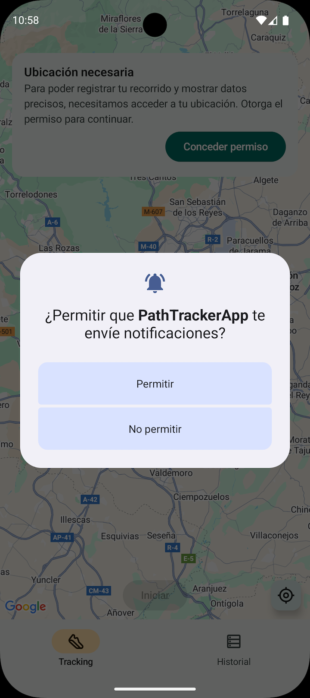         |              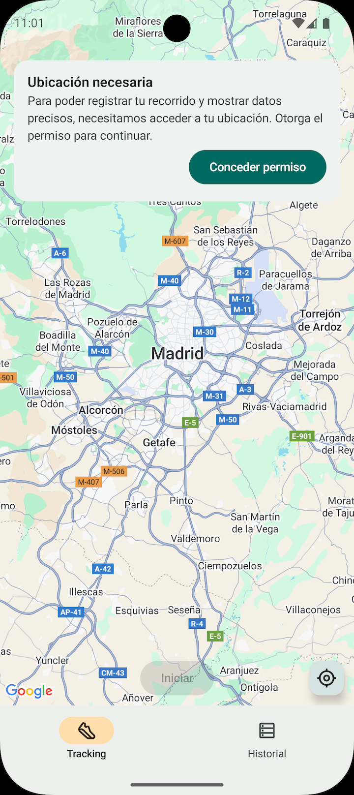              |    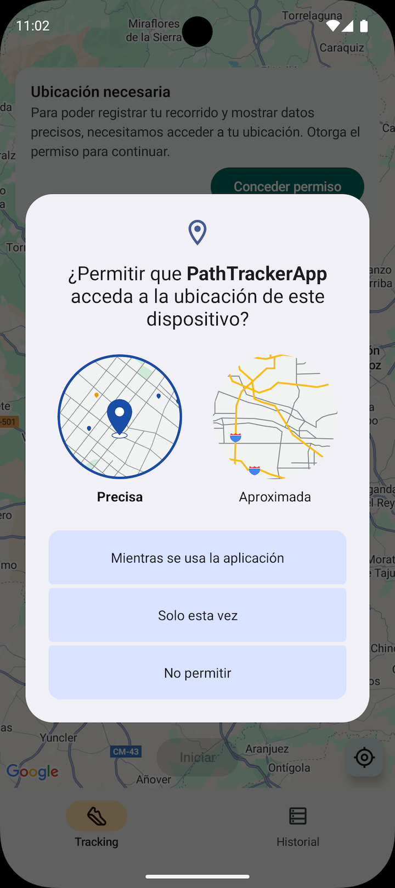    |
|                                                  **Aviso: GPS Desactivado**                                                  |                                                          **Activar GPS**                                                           |                                            **Tracking en Progreso**                                            |
|               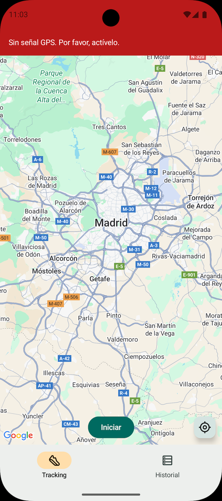                |               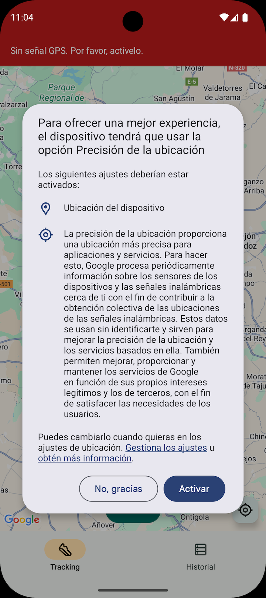                |              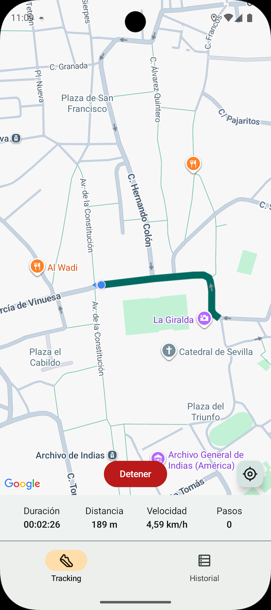              |
|                                                 **Notificación de Tracking**                                                 |                                               **Resumen de la Sesión (sin título)**                                                |                                        **Guardar Sesión (sin título)**                                         |
|       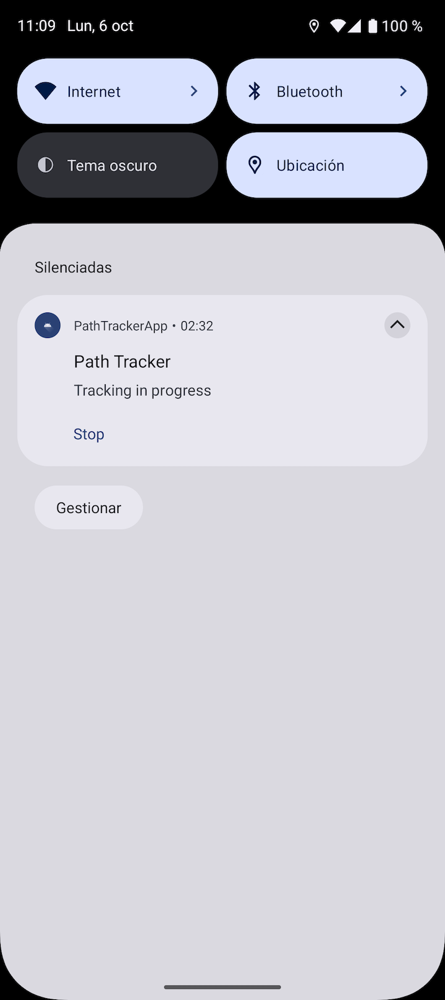        |         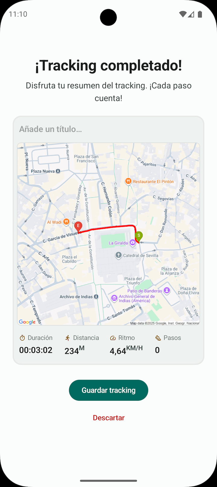          | 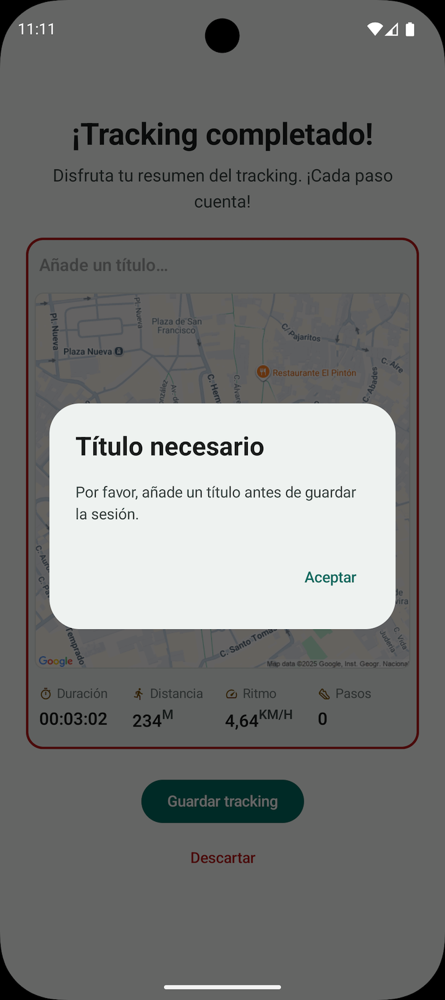 |
|                                            **Resumen de la Sesión (con título)**                                             |                                                        **Descartar Sesión**                                                        |                                              **Historial vacío**                                               |
| 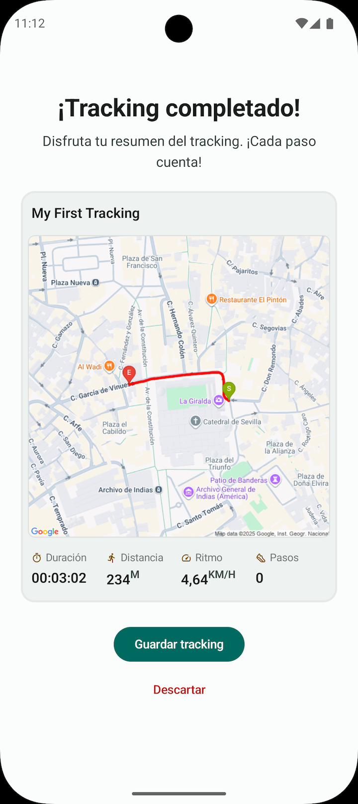 | 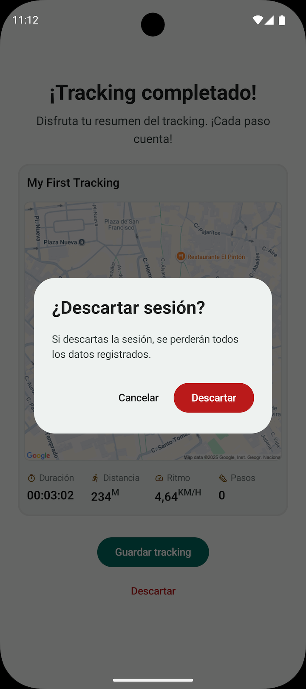 |                                  |
|                                                        **Historial**                                                         |                                                                                                                                    |                                                                                                                |
|                  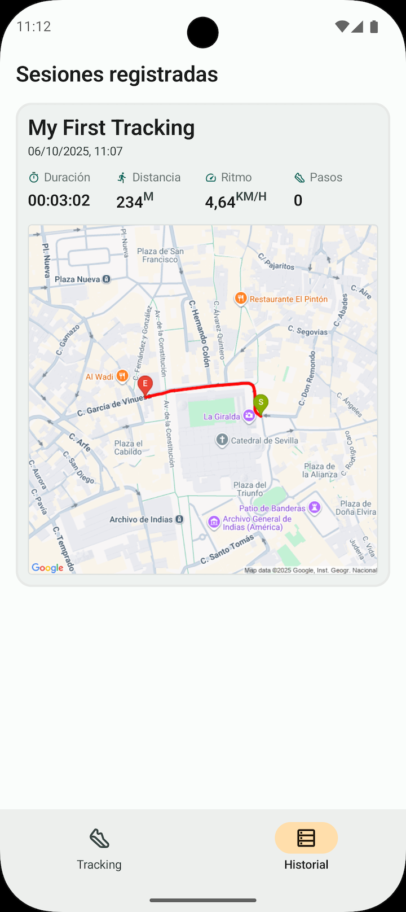                  |                                                                                                                                    |                                                                                                                |

## ⚙️ Instalación y Ejecución

1. **Clona este repositorio.**
2. Abre el proyecto en **Android Studio**.
3. Configura tu clave de la API de **Google Maps**:

* Obtén una API key en la [Google Cloud Console](https://console.cloud.google.com/google/maps-apis/overview).
* Añádela en el archivo `local.properties`:
  ```properties
  MAPS_API_KEY="tu_api_key_aquí"
  ```

4. **Sincroniza el proyecto** y ejecútalo en un dispositivo/emulador Android.

## 📞 Contacto

**Daniel Frías** - [danielfb2312@gmail.com](mailto:danielfb2312@gmail.com) - [LinkedIn Profile](https://www.linkedin.com/in/daniel-frias-balbuena/)
